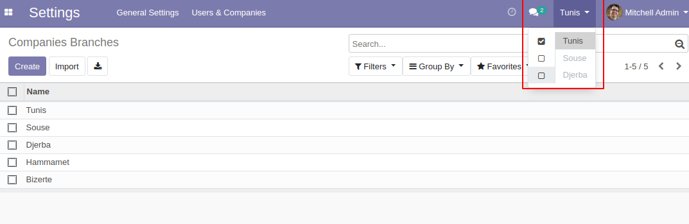

# Manage multiple branches per company

Using this App you can setup multiple branches per company. The concept of multi branch
operate same as multi company behaviors works in Odoo standard.

A user can be logged in multiple branches at once. This allows the user to access
information from multiple branches but also to create/edit records in a multi-branch
environment.

If not handled correctly, it may be the source of a lot of inconsistent multi-branch
behaviors. For instance, a user logged in both branches A and B could create a purchase
request in branch A and add products belonging to branch B to it. It is only when the
user will log out from branch B that access errors will occur for the sales order.

**Table of contents**

- [Overview](#overview)
  - [Adding company branches](#adding-company-branches)
  - [Assign branches to user](#assign-branches-to-user)
  - [Switch between branches](#switch-between-branches)
- [Configuration](#configuration)
- [Usage](#usage)
  - [Multi-branch consistency](#multi-branch-consistency)
  - [Default branch](#default-branch)
  - [Implementation](#implementation)
- [Bug Tracker](#bug-tracker)
- [Maintainer](#maintainer)

## Overview

#### Adding company branches

1. Go to Settings -> Users & Companies -> Companies Branches
2. Create your company branches.

   

#### Assign branches to user

On user form you are allowed to assigned branch to that user.


Also you need to set Multi Branch Group on User.

#### Switch between branches

It's easy to switch between branches, just click on the name of current branch in the
top right corner of the page then :

1. You can switch between branches by click on the name of the new branch.
2. You can choose what informations that you want to see for one or multiple branches.

   

## Configuration

You don't need a specific configuration.

## Usage

#### Multi-branch consistency

When a record is made shareable between several branches by the mean of a
`company_branch_id` field, we must take care that it cannot be linked to the record of
another branch through a relational field. For instance, we do not want to have a
purchase request and its products belonging to different branches.

#### Default branch

When the field `company_branch_id` is made required on a model, a good practice is to
set a default branch. It eases the setup flow for the user or even guarantees its
validity when the branch is hidden from the view. Indeed, the branch is usually hidden
if the user does not have access to multiple branches (i.e. when the user does not have
the group `base_branch.group_multi_branches`).

#### Implementation

If you want to implement multi-branch behaviors for your model you should:

**Add new field `company_branch_id` for your model**

```python
from odoo import fields, models
class MyModel(models.Model):
...._name = 'my.model'
....company_branch_id = fields.Many2one(
........"res.company.branch",
........string="Branch",
........copy=False,
........default=lambda self: self.env.user.company_branch_id.id)
```

if you want to make `company_branch_id` required you should set a default branch.

**Add Security rules**

When working with records shared across branches or restricted to a single branch, we
must take care that a user does not have access to records belonging to other branches.

This is achieved with security rules based on `branch_ids`, which contains the current
branches of the user (the branches the user checked in the multi-branches widget).

```xml
<record id="my_model_company_branch_rule" model="ir.rule">
....<field name="name">My Model Company Branch</field>
....<field name="model_id" ref="mymodule.model_my_model"/>
....<field name="global" eval="True"/>
....<field name="domain_force">['|' , ('company_branch_id','=',False), ('company_branch_id', '=', user.company_branch_id.id)]</field>
</record>
```

**Views**

the branch is usually hidden from the view if the user does not have access to multiple
branches. This is tested with the group `base_branch.group_multi_branches`.

```xml
<field name="company_branch_id" groups="base_branch.group_multi_branches"/>
```

## Bug Tracker

Bugs are tracked on [Gitlab Issues](https://gitlab.com/hadooc/odoo/base/issues)

In case of trouble, please check there if your issue has already been reported. If you
spotted it first, help us smash it by providing detailed and welcomed feedback.

## Maintainer


This module is maintained by Hadooc.

To contribute to this module, please visit
[Contributing Page](https://gitlab.com/hadooc/extra/wikis/Contributing).
